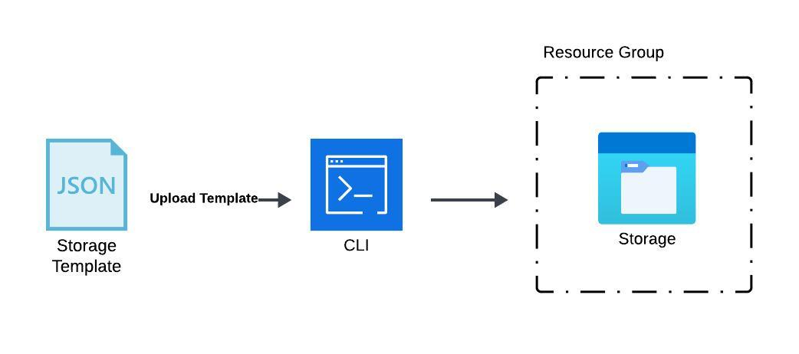
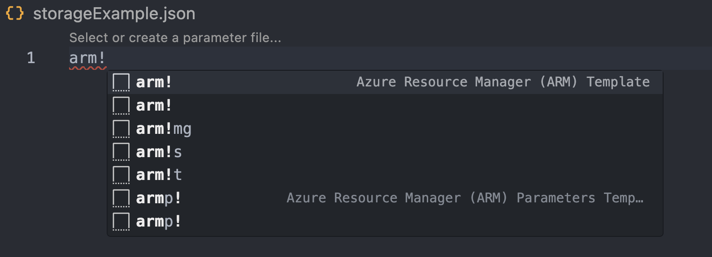
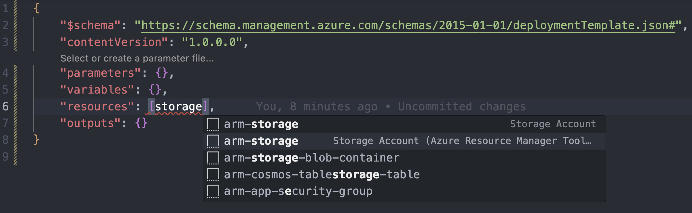
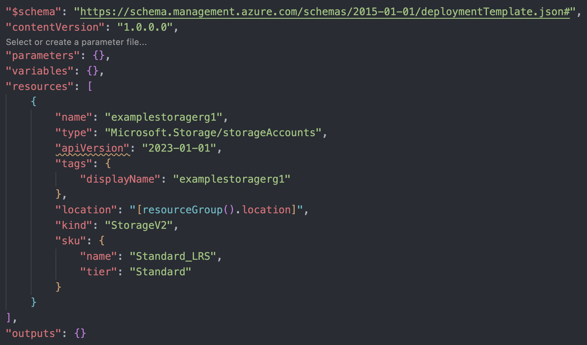
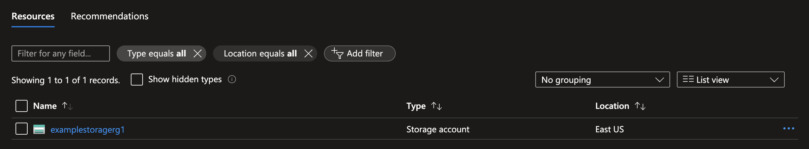

# Deploy Resources Using ARM templates

## How to use Azure Resource Manager (ARM) Templates to deploy a resource

In this example we will be deploying a storage account using an ARM Template we created in VS Code.

<sub>To get started, you first need to have a Microsoft Azure account. If you don't have one, you can create a free account [here.](https://azure.microsoft.com/en-us/free/search/?&ef_id=_k_Cj0KCQiA4NWrBhD-ARIsAFCKwWv39zVXs4ww7bj_IGmTJngZol8ZX835NOuvRgv7ygSk_rEe9lnrcGcaAg2vEALw_wcB_k_&OCID=AIDcmm5edswduu_SEM__k_Cj0KCQiA4NWrBhD-ARIsAFCKwWv39zVXs4ww7bj_IGmTJngZol8ZX835NOuvRgv7ygSk_rEe9lnrcGcaAg2vEALw_wcB_k_&gad_source=1&gclid=Cj0KCQiA4NWrBhD-ARIsAFCKwWv39zVXs4ww7bj_IGmTJngZol8ZX835NOuvRgv7ygSk_rEe9lnrcGcaAg2vEALw_wcB)</sub>



## Prerequisites

- **Virtual Studio Code** editor installed on you local machine.
- Azure Resource Manager Tool extension installed within **Virtual Studio Code**.
- An active Azure account, and permissions to create and manage Azure Storage resources.

## Initial Setup

First we create a `.json` file within our VS workspace. After creating the file and verifying you have the ARM Tool extension installed, we can type the following: `arm!` then select the first instance, as shown below.



## Resources Setup

Now within your new template, head down to `"resources": []` click inside the brackets and type `storage` then select the instance called `arm-storage` as shown below.



Once you have the ARM Storage Template created, you can change the `"name"` and `"displayName"` value to be unique and have your desired storage account name. You can also change all other values to fit your needs.



## Uploading ARM Template

After finishing your ARM Template within VS Code, save the `.json` file and open a terminal within the folder containing your ARM Template and run the code below.

```
az deployment group create --resource-group ResourceGroupName --template-file FileName.json
```

<sub>To learn more about the `az deployment group` command, click [here.](https://learn.microsoft.com/en-us/cli/azure/deployment/group?view=azure-cli-latest)</sub>

## Final Thoughts

As you can see the new Storage Account has been created inside of my specified Resource Group.



This was a simple Storage Account ARM Template demonstration. ARM Templates can be very useful and if you would like to learn more about them check out [this article.](https://learn.microsoft.com/en-us/azure/azure-resource-manager/templates/)

## Feedback

If you have and feedback or suggestions, you can leave a comment in the open pull request for this branch. Thank you!
